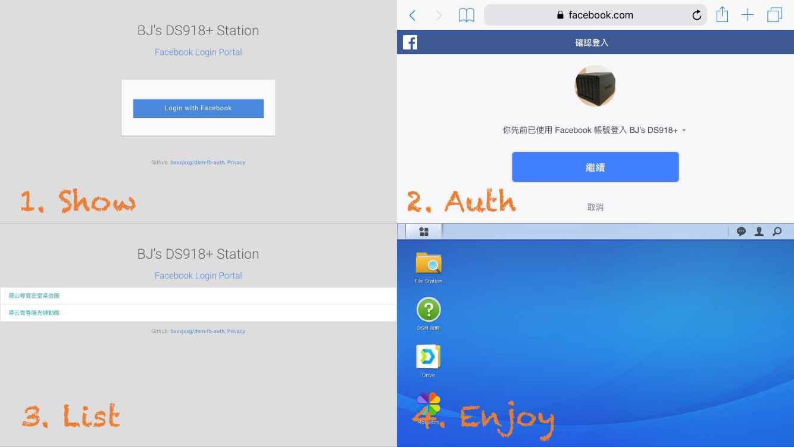

# A fb-auth integration tutorial for NAS

A quick study and fb-auth integration with my DS918+.

## Prerequisites
- DS918+ Disk Station
- WebStation Package
- PHP 7.0 Package (with openssl.so module enabled)
- Facebook Application app_id and app_secret

## Installation
1. Clone this project into your workspace  
git clone https://github.com/bxxxjxxg/dsm-fb-auth or  
wget https://github.com/bxxxjxxg/dsm-fb-auth/archive/V1.0.tar.gz && tar zxvf V1.0.tar.gz 

2. Create https://your-website/fb-login/ portal 
cp dsm-fb-auth/etc/nginx/conf.d/www.fb-login.conf /etc/nginx/conf.d/  
mkdir /var/services/web/fb-login && chmod 755 /var/services/web/fb-login/  
\# Restart your WebStation package to take effect   
\# For verifcation,  
\# 1) you can check whether /run/php-fpm/php70-fpm.sock exists or not.  
\# 2) you can put a hello-world index.php and try to browse https://your-website/fb-login/

3. Download Facebook PHP SDK into fb-login/  
wget https://github.com/facebook/php-graph-sdk/archive/5.6.1.tar.gz  
tar zxvf 5.6.1.tar.gz  
mv php-graph-sdk/src /var/services/web/fb-login/  

4. Copy source code into fb-login/  
cp dsm-db-auth/var/services/web/fb-login/* /var/services/web/fb-login/

5. Fill the configuration into force  
vim /var/services/web/fb-login/config.php  

6. Finish. Browse https://your-website/fb-login/ and make sure it works.  
\# You should also publish your Facebook application. Then other people can authenicate them afterwards.

## FAQ
1. I see the "file_get_contents errors with https wrapper". How to deal with it?  
Please enable openssl.so for PHP 7.0 and try again.

## Reference
- Facebook Dev Center: https://developers.facebook.com/
- Facebook PHP SDK: https://developers.facebook.com/docs/reference/php/
- Synology Dev Center: https://www.synology.com/zh-tw/support/developer
- facebook/php-graph-sdk: https://github.com/facebook/php-graph-sdk
- Entry Layout CSS: https://codepen.io/russbeye/pen/MYeroq
